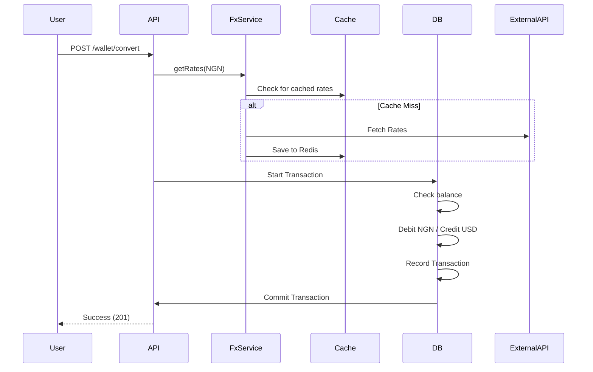
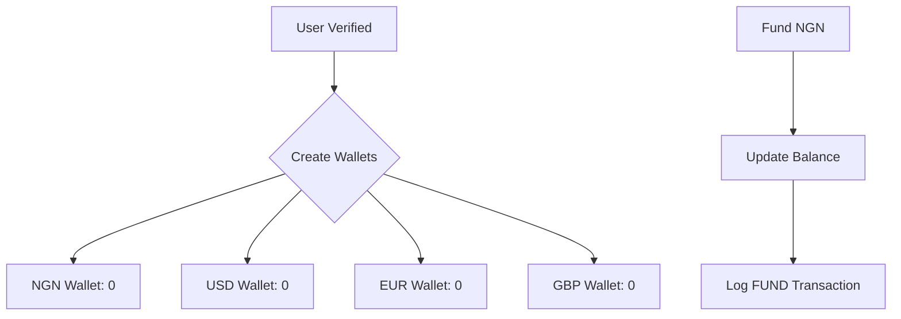

# FX Trading App

A robust NestJS backend for a multi-currency FX trading platform where users can trade currencies, including Naira (NGN) and other international currencies.

## 🚀 Getting Started

### Prerequisites
- Node.js (v18+)
- PostgreSQL
- Redis

### Setup
1. **Clone the repository**
2. **Install dependencies**
   ```bash
   npm install
   ```
3. **Configure environment**
   - Copy `.env.example` to `.env`
   - Fill in your database and API credentials.
4. **Run the application**
   ```bash
   # Development
   npm run start:dev
   ```
5. **API Documentation**
   - Once running, Swagger UI is available at `http://localhost:3000/api/docs`

### 🔑 Administrative Access
To bootstrap an admin account:
1. Set `SUPERADMIN_EMAIL=your-email@example.com` in your `.env`.
2. Register with that exact email.
3. The user will be automatically assigned the `ADMIN` role.
4. Use this account to promote other users via `PATCH /api/users/:id/promote`.

---

## 🏗️ Architecture Decisions

> [!NOTE]
> For a detailed breakdown of the technical rationale and assumptions behind our design (FX Rates, Wallet Security, and Data Precision), see [**DECISIONS.md**](./DECISIONS.md).

### 1. Layered Architecture
We follow the standard NestJS modular architecture split into Controller -> Service -> Entity/Repository. This ensures:
- **Scalability**: Modules are self-contained and can be extracted into microservices if needed.
- **Testability**: Service logic can be tested independently of HTTP concerns.

### 2. Database Design & Reliability
- **PostgreSQL**: Chosen for its ACID compliance and robust transaction support, which is critical for financial applications.
- **Atomic Transactions**: All balance mutations are wrapped in DB transactions using TypeORM `QueryRunner` to ensure atomicity. If any part of a multi-step update (e.g., wallet credit + transaction log) fails, the entire process is rolled back.
- **Pessimistic Locking**: To prevent **race conditions** in high-frequency trading, we use `SELECT FOR UPDATE` when fetching balances for mutation. This ensures that concurrent requests for the same user wallet are serialized at the database level.
- **Idempotency**: All funding requests (`/wallet/fund`) require a unique reference/idempotency key. This prevents double-funding if a user or network retries a request.
- **Precision**: Monetary values are stored as `DECIMAL(18, 4)` to avoid floating-point rounding errors common in standard number types.

### 3. FX Rates & High Availability
- **Multi-layer Fallback**: To ensure reliability, FX rates follow a **Cache -> API -> DB** strategy.
    - **Redis (Fresh)**: Rates are cached with a **15-minute TTL** (900s) to balance performance and API quota usage.
    - **External API**: If cache is empty, we fetch from **ExchangeRate-API**.
    - **PostgreSQL (Stale Fallback)**: If the API is down, we fall back to the last successfully persisted rates in the database (marked with `stale: true`).
- **Data Integrity**: While stale data is allowed for reading rates, **mutations** (conversion/trading) strictly require fresh data from the cache/API to prevent financial discrepancies.

### 4. Email Delivery (Strategy Pattern)
- **Abstraction**: Email delivery is abstracted behind a `MailProvider` interface. This allows seamless switching between providers (SMTP, Resend, SES) without modifying business logic.
- **Tradeoff - Sync vs Async Email**: To maintain a low-complexity infrastructure for the MVP, OTP emails are sent **synchronously**.
    - **Pros**: Immediate client-side feedback if the provider is down; no need for message brokers (Redis/BullMQ) or separate worker processes.
    - **Cons**: Higher request latency during registration.
    - **Decision**: Deferred background workers until infrastructure scale justifies the overhead of managing a persistent queue.

### 5. Identity & Access Control (RBAC)
- **Global Protection**: All routes are protected by `JwtAuthGuard` by default.
- **Public Access**: Specific endpoints (e.g., registration, health check) are explicitly white-listed using a custom `@Public()` decorator.
- **Role System**: Simple `USER` / `ADMIN` hierarchy.
    - **Promotion**: A configured `SUPERADMIN_EMAIL` is automatically granted `ADMIN` status upon registration. This admin can then promote other users.
- **JWT Strategy**: Stateless authentication using signed JWTs.

### 6. Transaction History
- **Auditability**: Every wallet mutation creates a permanent record in the `transactions` table, storing the exact rate used and amounts in both currencies.
- **Filtering**: Users can filter their history by `type` (FUND, CONVERT, TRADE) and navigate using limit/offset pagination.

### 7. Consistent API Responses
- **Response Wrapper**: All successful responses are intercepted and wrapped in a standard JSON envelope: `{ "success": true, "statusCode": 200, "message": "...", "data": [...] }`.
- **Error Filtering**: A global `HttpExceptionFilter` ensures that even errors follow a predictable structure, aiding frontend integration.

---

## 🛠️ Key Assumptions
1. **Base Funding**: Users can only fund their wallets in **Naira (NGN)**. All other currencies must be acquired via conversion or trading.
2. **Exchange Rates**: ExchangeRate-API is used as the primary source of truth for real-time rates.
3. **Multi-currency**: A user's wallet supports NGN, USD, EUR, and GBP by default.
4. **Trade Logic**: Trading is implemented as a single-step atomic operation (no quote/reconfirmation delay). This is an MVP simplification to avoid the complexity of temporary quote management.
5. **No Spread**: For this assessment, we use mid-market rates without an additional currency spread or transaction fee.

---

## 📊 Flow Diagrams

### Currency Conversion Flow


### Wallet Management Flow


